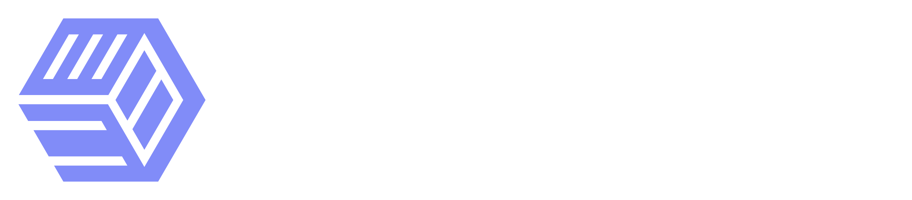

# DockStacks 🐳

**DockStacks** is a curated repository of Docker Compose templates for popular applications. Simplify your deployments with ready-to-use stacks!

---

## Features ✨

- **Pre-built Templates**: Quickly deploy apps like Nginx, PostgreSQL, or WordPress.
- **Community-Driven**: Submit your own stacks or improve existing ones.
- **Easy Integration**: Compatible with DockStat and DockStatAPI.

## Getting Started 🚀

1. **Browse Templates**: Explore the [templates](./templates) directory.
2. **Deploy**: Use a DockStat or another tool to deploy your chosen stack.
3. **Contribute**: Share your Docker setups by following our [contribution guide](./CONTRIBUTE.md).

---

## Available Stacks

| Icon | Name | Schema |
|------|------|--------|
||AdGuardHome|[AdGuardHome](./templates/adguardhome/template.json)
||Bookstack|[Bookstack](./templates/bookstack/template.json)
||Gitea|[Gitea](./templates/gitea/template.json)
||Grafana|[Grafana](./templates/grafana/template.json)
||Heimdall|[Heimdall](./templates/heimdall/template.json)
|/|Home Assistant|[Home Assistant](./templates/home-assistant/template.json)
||Nginx-proxy-manager|[Nginx-proxy-manager](./templates/nginx-proxy-manager/template.json)
|/|PiHole|[PiHole](./templates/pihole/template.json)
|/|qCDN|[qCDN](./templates/qcdn/template.json)
||Tianji|[Tianji](./templates/tianji/template.json)
||Uptime-Kuma|[Uptime-Kuma](./templates/uptime-kuma/template.json)
## Contributing 🙌

We welcome community templates! Learn how to add yours in the [CONTRIBUTE.md](./CONTRIBUTE.md) guide.

---

