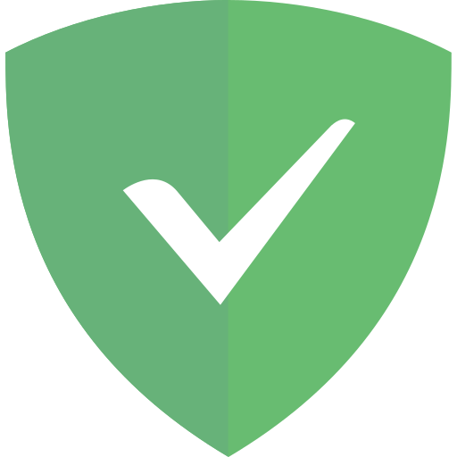

# DockStacks

Welcome to DockStacks, this is the Repository to define various app templates for compatible DockStatAPI consumers.

Please see [CONTRIBUTE](./CONTRIBUTE.md) for more info on how to add your favorite Docker setup to DockStacks.

---
| Icon | Name | Schema |
|------|------|--------|
||"AdGuardHome"|[./templates/adguardhome](./templates/adguardhome/template.json)
||"Bookstack"|[./templates/bookstack](./templates/bookstack/template.json)
||"Gitea"|[./templates/gitea](./templates/gitea/template.json)
||"Grafana"|[./templates/grafana](./templates/grafana/template.json)
||"Heimdall"|[./templates/heimdall](./templates/heimdall/template.json)
||"Nginx-proxy-manager"|[./templates/nginx-proxy-manager](./templates/nginx-proxy-manager/template.json)
|None|"PiHole"|[./templates/pihole](./templates/pihole/template.json)
|None|"qCDN"|[./templates/qcdn](./templates/qcdn/template.json)
||"Tianji"|[./templates/tianji](./templates/tianji/template.json)
||"Uptime-Kuma"|[./templates/uptime-kuma](./templates/uptime-kuma/template.json)
